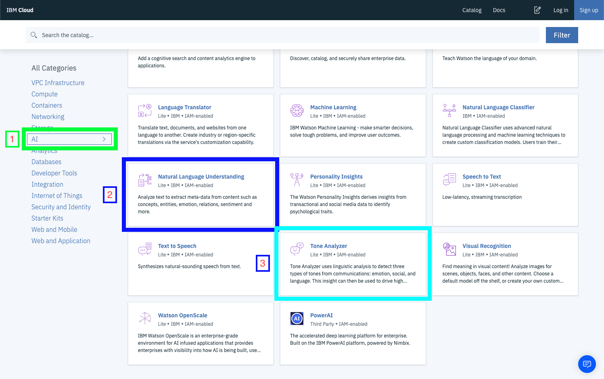

# Workshop

In this workshop we will only deal with the Natural Language Understanding and Tone Analyzer.

The goal is to see how to use the api yourself. With the time we have it wont make much sense to try to make a full project.

Instead we will see how to work with this in nodejs.

In your IBM Cloud Dahsboard, click catalog in the top nav bar. On the side under all categories select AI.

We will create an instance of Natural Language Understanding and Tone Analyzer in the next steps. 

