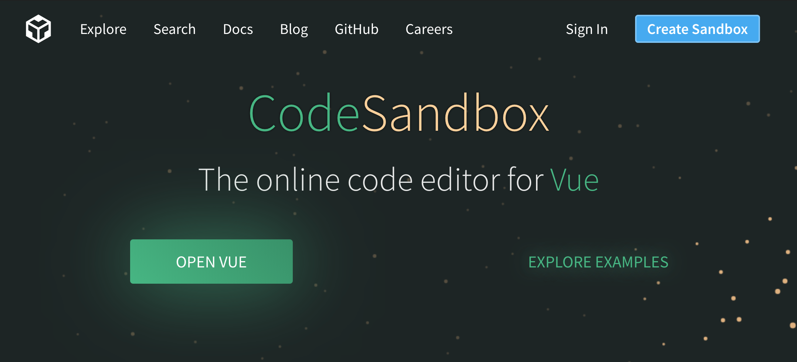
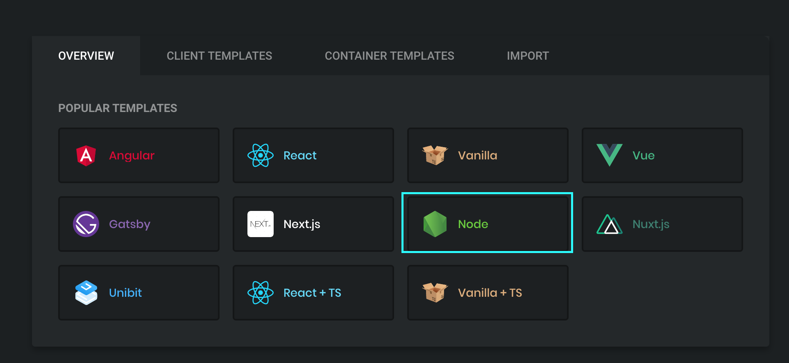
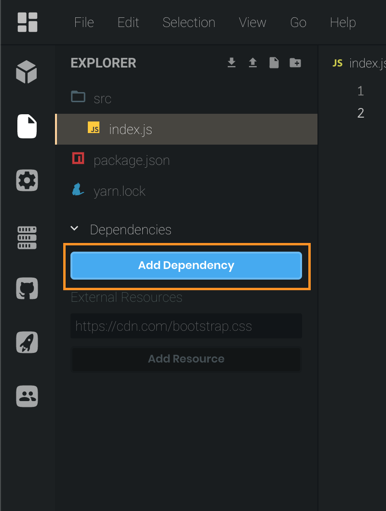
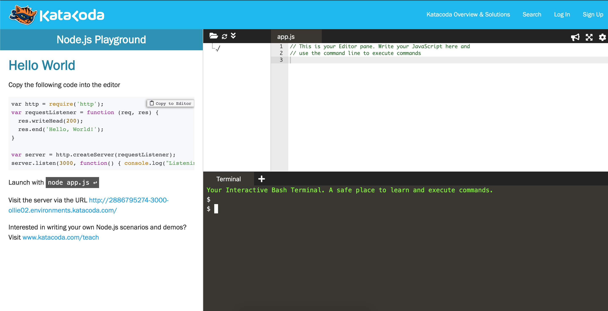

# Setup

This workshop we use node.

 You have one of 3 choices. 

1. Install Node \(Or already have that installed\)
2. Use CodeSandBox A web IDE for JS projects.
3. Use Katacoda, A web based learning platform.

Depending on what you want to do, choose one of the following tabs



You have chosen to use NodeJS locally in your machine. A wise choice.

If you have node installed you can test on your terminal.

```text
node -v
```

If there is output version, you have node. Skip the rest of the content in this tab.

If not continue.

[Install Node](https://nodejs.org/en/download/) - From this website find your os and install.

After installation is complete and all the path variable is in place, from your terminal test the node version

```text
node -v
```

With that we are good to go.



Go to [codesandbox.io](https://codesandbox.io) 

Signin with your github account.



Click on Create Sandbox



Select Node.

This will setup a NodeJS server program. We don't much care for it. 

Delete the content of the index.js file. We will fill it up later. 

> If you see the web browser crash dont worry. We got rid of the server code. Its supposed to fail.

Click on Add Dependency



Search for `ibm-watson` Click to install


You can skip to the next page now.



[katacoda node js playground](https://www.katacoda.com/courses/nodejs/playground)

You can choose to login/signup but you can use this service anonymously.

This gives you a terminal and a file view



We will use this terminal to run our commands.




If you chose to use CodeSandBox a npm project with a package.json is already setup. But for the other two cases we will have to setup a npm project.

Skip this steps and move to the next section if you are doing it in **CodeSandBox**

**NodeJS Local / Katacoda**

In the terminal.

```text
mkdir watson-text-analyze
```

> I have tested these on a mac and on the Katacoda terminal. If you have os where these commands does not work refer to the internet.

```text
cd watson-text-analyze
```

```text
npm init
```

Select default for everything.

This selected `index.js` as the entry point. Lets create that file.

```text
touch index.js
```

To install watson node sdk

```text
npm install --save ibm-watson
```

In katacoda you can use the file explorer to open the file. In your local machine you can use your favorite text editor \(vi, emacs, nano, VSCode\) to open the files in the folder.

