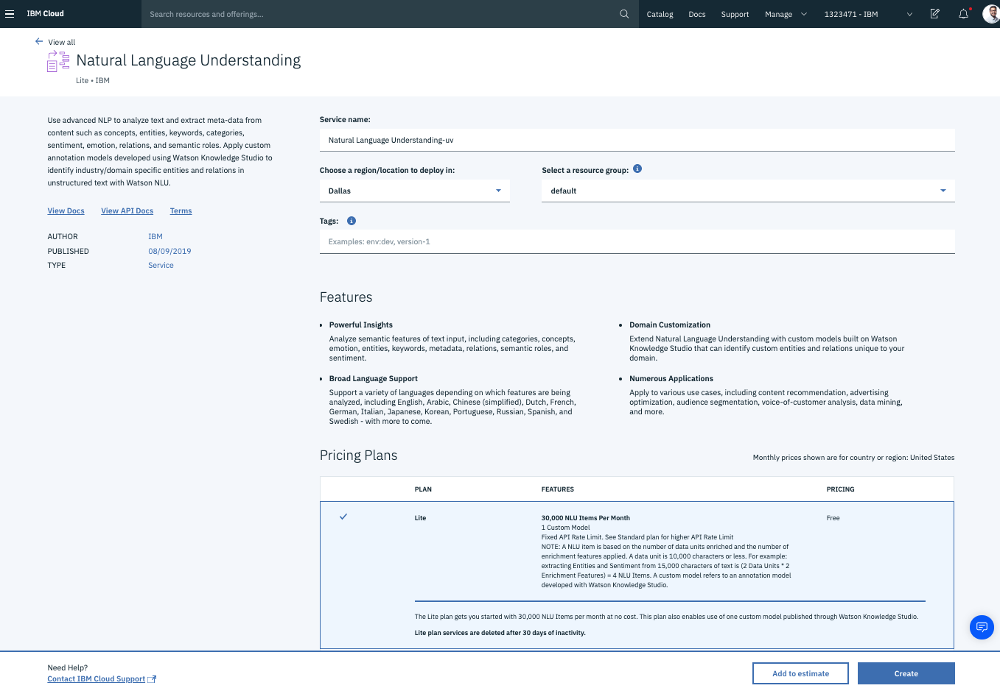

# Watson NLU

* Give the service a name.
* Select Lite.
* Click Create.



* Once the service is created. From the mage tab we can find the URL and API Key.


We will need that in the next stop.

In the next step we will use node one of many supported client libraries to use NLU to gather insight about some text.

In the `index.js` file add the following

```javascript
const NaturalLanguageUnderstandingV1 = require("ibm-watson/natural-language-understanding/v1");

const naturalLanguageUnderstanding = new NaturalLanguageUnderstandingV1({
  version: "2019-07-12",
  iam_apikey: "your-api-key",
  url: "https://gateway.watsonplatform.net/natural-language-understanding/api"
});
```

This initializes the service.

Lets use it.

```javascript
const analyzeParams = {
  features: {
    categories: {
      limit: 3
    },
    concepts: {
      limit: 3
    },
    entities: {
      emotion: true,
      sentiment: true,
      limit: 2
    },
    keywords: {
      sentiment: true,
      emotion: true,
      limit: 3
    },
    relations: {}
  },
  text:
    "Leonardo DiCaprio won Best Actor in a Leading Role for his performance."
};
```

This object has the following.

1. List of features we would like to have extracted.
2. The text we are running the NLU model on.

Finally we want to get the result and print out the output.

```javascript
naturalLanguageUnderstanding
  .analyze(analyzeParams)
  .then(analysisResults => {
    console.log(JSON.stringify(analysisResults, null, 2));
  })
  .catch(err => {
    console.log("error:", err);
  });
```

And thats all. Lets run it.

In the terminal \(for CodeSandBox it will run on save\)

```text
node index.js
```

This is the output.

```typescript
{
  "usage": {
    "text_units": 1,
    "text_characters": 71,
    "features": 5
  },
  "relations": [
    {
      "type": "awardedTo",
      "sentence": "Leonardo DiCaprio won Best Actor in a Leading Role for his performance.",
      "score": 0.680715,
      "arguments": [
        {
          "text": "Best Actor",
          "location": [
            22,
            32
          ],
          "entities": [
            {
              "type": "EntertainmentAward",
              "text": "Best Actor"
            }
          ]
        },
        {
          "text": "Leonardo DiCaprio",
          "location": [
            0,
            17
          ],
          "entities": [
            {
              "type": "Person",
              "text": "Leonardo DiCaprio"
            }
          ]
        }
      ]
    }
  ],
  "language": "en",
  "keywords": [
    {
      "text": "Leonardo DiCaprio",
      "sentiment": {
        "score": 0.869987,
        "label": "positive"
      },
      "relevance": 0.999973,
      "emotion": {
        "sadness": 0.028003,
        "joy": 0.626536,
        "fear": 0.020288,
        "disgust": 0.035078,
        "anger": 0.015693
      },
      "count": 1
    },
    {
      "text": "Best Actor",
      "sentiment": {
        "score": 0.869987,
        "label": "positive"
      },
      "relevance": 0.986622,
      "emotion": {
        "sadness": 0.028003,
        "joy": 0.626536,
        "fear": 0.020288,
        "disgust": 0.035078,
        "anger": 0.015693
      },
      "count": 1
    },
    {
      "text": "Leading Role",
      "sentiment": {
        "score": 0.869987,
        "label": "positive"
      },
      "relevance": 0.949084,
      "emotion": {
        "sadness": 0.028003,
        "joy": 0.626536,
        "fear": 0.020288,
        "disgust": 0.035078,
        "anger": 0.015693
      },
      "count": 1
    }
  ],
  "entities": [
    {
      "type": "Person",
      "text": "Leonardo DiCaprio",
      "sentiment": {
        "score": 0.869987,
        "label": "positive"
      },
      "relevance": 0.978348,
      "emotion": {
        "sadness": 0.028003,
        "joy": 0.626536,
        "fear": 0.020288,
        "disgust": 0.035078,
        "anger": 0.015693
      },
      "disambiguation": {
        "subtype": [
          "Actor",
          "AwardNominee",
          "AwardWinner",
          "Celebrity",
          "FilmActor",
          "FilmProducer",
          "TVActor",
          "TVProducer"
        ],
        "name": "Leonardo_DiCaprio",
        "dbpedia_resource": "http://dbpedia.org/resource/Leonardo_DiCaprio"
      },
      "count": 1,
      "confidence": 0.999095
    }
  ],
  "concepts": [
    {
      "text": "Leonardo DiCaprio",
      "relevance": 0.980803,
      "dbpedia_resource": "http://dbpedia.org/resource/Leonardo_DiCaprio"
    },
    {
      "text": "Kate Winslet",
      "relevance": 0.815393,
      "dbpedia_resource": "http://dbpedia.org/resource/Kate_Winslet"
    },
    {
      "text": "Academy Award for Best Actor",
      "relevance": 0.76418,
      "dbpedia_resource": "http://dbpedia.org/resource/Academy_Award_for_Best_Actor"
    }
  ],
  "categories": [
    {
      "score": 0.854887,
      "label": "/art and entertainment/movies and tv/movies/reviews"
    },
    {
      "score": 0.78057,
      "label": "/art and entertainment/movies/film festivals and awards"
    },
    {
      "score": 0.680636,
      "label": "/art and entertainment/movies and tv/romantic comedies"
    }
  ]
}
```


